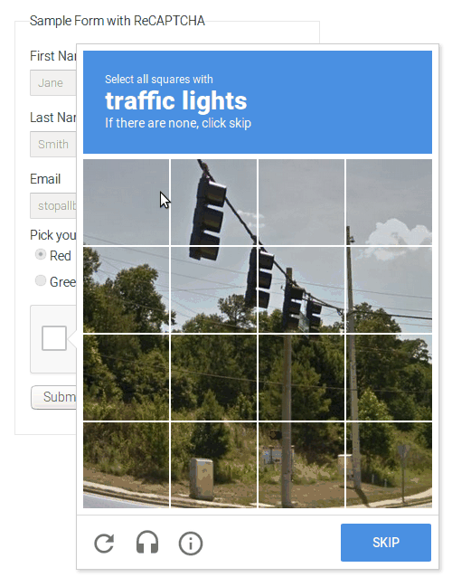

=========
deCAPTCHA
=========

.. image:: https://img.shields.io/pypi/v/decaptcha.svg
    :target: https://pypi.python.org/pypi/decaptcha
    :alt: PyPI

.. image:: https://travis-ci.com/balanceofprobability/decaptcha.svg?branch=master
    :target: https://travis-ci.com/balanceofprobability/decaptcha
    :alt: Build Status

.. image:: https://coveralls.io/repos/github/balanceofprobability/decaptcha/badge.svg?branch=master
    :target: https://coveralls.io/repos/github/balanceofprobability/decaptcha?branch=master
    :alt: Coverage Status

.. image:: https://readthedocs.org/projects/decaptcha/badge/?version=latest
    :target: https://decaptcha.readthedocs.io/en/latest/?badge=latest
    :alt: Documentation Status

.. image:: https://pyup.io/repos/github/balanceofprobability/decaptcha/shield.svg
     :target: https://pyup.io/repos/github/balanceofprobability/decaptcha/
     :alt: Updates

.. image:: https://img.shields.io/badge/License-MIT-yellow.svg
    :target: https://opensource.org/licenses/MIT
    :alt: License

.. image:: https://img.shields.io/badge/PRs-welcome-brightgreen.svg?style=flat-square
     :target: http://makeapullrequest.com
     :alt: PRs Welcom

A GUI automation Python module for solving Google reCAPTCHA v2

* Free software: MIT license
* Documentation: https://decaptcha.readthedocs.io.

Installation
------------

Recommended:

- Ubuntu/Debian
- Python 3.6

Prerequisites:

- `Google Tesseract OCR <https://github.com/tesseract-ocr/tesseract>`_
- `Geckodriver <https://github.com/mozilla/geckodriver>`_
- `Scrot <https://github.com/dreamer/scrot>`_
- `YOLOv3 Model <https://github.com/OlafenwaMoses/ImageAI/releases/tag/1.0/>`_

| Installing via pip:

Check the `decaptcha package page <https://pypi.python.org/pypi/decaptcha>`_ for more information.

.. code-block:: bash

    $ (env)> pip install decaptcha

| Or if you have git installed:

.. code-block:: bash

    $ (env)> pip install -U git+https://github.com/balanceofprobability/decaptcha.git

| Installing from source:

.. code-block:: bash

    $> git clone https://github.com/balanceofprobability/decaptcha.git
    $ (env)> cd decaptcha && pip install -U .

Usage
-----

**Quickstart**

For a live demo, open a web browser and visit https://www.google.com/recaptcha/api2/demo, then run the following code block via a Python script or Python REPL.

.. code-block:: python

    from decaptcha.notarobot import NotARobot

    janet = NotARobot()
    janet.set_model("yolo.h5")
    janet.run()

Credits
-------

This package was created with Cookiecutter_ and the `audreyr/cookiecutter-pypackage`_ project template.

.. _Cookiecutter: https://github.com/audreyr/cookiecutter
.. _`audreyr/cookiecutter-pypackage`: https://github.com/audreyr/cookiecutter-pypackage
